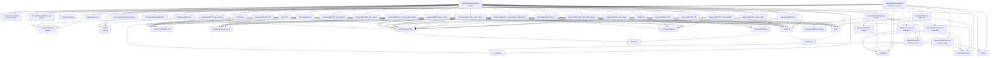

# GridForge MATLAB Call Tree

Generated 2026-07-07 by `gridforge/tools/analyze_matlab_calls.py`.
Solid boxes = active functions; annotations list external deps.

```mermaid
flowchart TD
    NationalGarverExpansion --> BuildANet
    NationalGarverExpansion --> CreateGeneratorData
    NationalGarverExpansion --> CreateOLMatrices
    NationalGarverExpansion --> EconomicDispatch
    NationalGarverExpansion --> EconomicDispatchConverse
    NationalGarverExpansion --> GarverAlgorithmCPLEX
    NationalGarverExpansion --> OLPathDistances
    NationalGarverExpansion --> TrimGarverLines
    NationalGarverExpansion --> UCED
    NationalGarverExpansion --> cell2csv
    NationalConductorSizing --> ACPFLinf
    NationalConductorSizing --> ACPowerFlowFinal
    NationalConductorSizing --> AddTransformers
    NationalConductorSizing --> AssignCondParamFinal
    NationalConductorSizing --> AssignCondParameters
    NationalConductorSizing --> BuildANet
    NationalConductorSizing --> CreateGeneratorData
    NationalConductorSizing --> DCPF2Linf
    NationalConductorSizing --> DCPFLinf
    NationalConductorSizing --> DCPowerFlowFinal
    NationalConductorSizing --> EconomicDispatch
    NationalConductorSizing --> EconomicDispatchConverse
    NationalConductorSizing --> GarverFinalResultsProcessing
    NationalConductorSizing --> GenerateTargetDistribution
    NationalConductorSizing --> LineFinder
    NationalConductorSizing --> ManuallyAddLines
    NationalConductorSizing --> NetworkStatistics
    NationalConductorSizing --> PlotResultsFunction
    NationalConductorSizing --> RXB
    NationalConductorSizing --> RXBFinal
    NationalConductorSizing --> SeparateNetworkVoltages
    NationalConductorSizing --> SequentialACPF_ED
    NationalConductorSizing --> SequentialACPF_ED_Angles
    NationalConductorSizing --> SequentialACPF_ED_N_1
    NationalConductorSizing --> SequentialDCPF2_ConverseED
    NationalConductorSizing --> SequentialDCPF2_ConverseED_Angles
    NationalConductorSizing --> SequentialDCPF2_ED
    NationalConductorSizing --> SequentialDCPF2_ED_Angles
    NationalConductorSizing --> SequentialDCPF3_ConverseED
    NationalConductorSizing --> SequentialDCPF3_ED
    NationalConductorSizing --> SequentialDCPF_ConverseED
    NationalConductorSizing --> SequentialDCPF_ConverseED_Angles
    NationalConductorSizing --> SequentialDCPF_ConverseED_GenLinesN_1
    NationalConductorSizing --> SequentialDCPF_ED
    NationalConductorSizing --> SequentialDCPF_ED_Angles
    NationalConductorSizing --> SequentialDCPF_ED_GenLinesN_1
    NationalConductorSizing --> SequentialDCPF_ED_GenN_1
    NationalConductorSizing --> UCED
    NationalConductorSizing --> cell2csv
    CreateOLMatrices --> OLPathDistances
    CreateOLMatrices --> RXB
    GarverAlgorithmCPLEX --> LineFinder
    GarverAlgorithmCPLEX --> cell2csv
    ACPFLinf --> AssignCondParamFinal
    ACPFLinf --> NetworkStatistics
    ACPowerFlowFinal --> YBusCalc
    DCPF2Linf --> AssignCondParamFinal
    DCPF2Linf --> NetworkStatistics
    DCPFLinf --> AssignCondParameters
    DCPFLinf --> DCPowerFlowFinal
    DCPFLinf --> NetworkStatistics
    DCPFLinf --> RXB
    DCPowerFlowFinal --> YBusCalc
    ManuallyAddLines --> AssignCondParamFinal
    ManuallyAddLines --> AssignCondParameters
    ManuallyAddLines --> LineFinder
    ManuallyAddLines --> OLPathDistances
    RXB --> GMDData
    RXBFinal --> GMDData
    SeparateNetworkVoltages --> AssignCondParamVoltage
    SeparateNetworkVoltages --> BuildANet
    SeparateNetworkVoltages --> FiedlerPartitioning
    SeparateNetworkVoltages --> GarverIslandConnections
    SeparateNetworkVoltages --> PartitionProcessing
    SeparateNetworkVoltages --> SaveWritePartitions
    SequentialACPF_ED --> ACPowerFlowFinal
    SequentialACPF_ED --> RXBFinal
    SequentialACPF_ED_Angles --> ACPowerFlowFinal
    SequentialACPF_ED_Angles --> AssignCondParamFinal
    SequentialACPF_ED_Angles --> RXBFinal
    SequentialACPF_ED_N_1 --> ACPowerFlowFinal
    SequentialACPF_ED_N_1 --> AssignCondParamFinal
    SequentialACPF_ED_N_1 --> RXBFinal
    SequentialDCPF2_ConverseED --> DCPowerFlowFinal
    SequentialDCPF2_ConverseED --> RXBFinal
    SequentialDCPF2_ConverseED_Angles --> AssignCondParamFinal
    SequentialDCPF2_ConverseED_Angles --> DCPowerFlowFinal
    SequentialDCPF2_ConverseED_Angles --> RXBFinal
    SequentialDCPF2_ED --> DCPowerFlowFinal
    SequentialDCPF2_ED --> RXBFinal
    SequentialDCPF2_ED_Angles --> AssignCondParamFinal
    SequentialDCPF2_ED_Angles --> DCPowerFlowFinal
    SequentialDCPF2_ED_Angles --> RXBFinal
    SequentialDCPF3_ConverseED --> AssignCondParamFinal
    SequentialDCPF3_ConverseED --> DCPowerFlowFinal
    SequentialDCPF3_ConverseED --> RXBFinal
    SequentialDCPF3_ED --> AssignCondParamFinal
    SequentialDCPF3_ED --> DCPowerFlowFinal
    SequentialDCPF3_ED --> RXBFinal
    SequentialDCPF_ConverseED --> DCPowerFlowFinal
    SequentialDCPF_ConverseED --> NetworkStatistics
    SequentialDCPF_ConverseED --> RXB
    SequentialDCPF_ConverseED_Angles --> AssignCondParameters
    SequentialDCPF_ConverseED_Angles --> DCPowerFlowFinal
    SequentialDCPF_ConverseED_Angles --> RXB
    SequentialDCPF_ConverseED_GenLinesN_1 --> AssignCondParameters
    SequentialDCPF_ConverseED_GenLinesN_1 --> DCPowerFlowFinal
    SequentialDCPF_ConverseED_GenLinesN_1 --> RXB
    SequentialDCPF_ED --> DCPowerFlowFinal
    SequentialDCPF_ED --> NetworkStatistics
    SequentialDCPF_ED --> RXB
    SequentialDCPF_ED_Angles --> AssignCondParameters
    SequentialDCPF_ED_Angles --> DCPowerFlowFinal
    SequentialDCPF_ED_Angles --> RXB
    SequentialDCPF_ED_GenLinesN_1 --> AssignCondParameters
    SequentialDCPF_ED_GenLinesN_1 --> DCPowerFlowFinal
    SequentialDCPF_ED_GenLinesN_1 --> NetworkStatistics
    SequentialDCPF_ED_GenLinesN_1 --> RXB
    SequentialDCPF_ED_GenN_1 --> AssignCondParameters
    SequentialDCPF_ED_GenN_1 --> DCPowerFlowFinal
    SequentialDCPF_ED_GenN_1 --> EconomicDispatch
    SequentialDCPF_ED_GenN_1 --> RXB
    SequentialDCPF_ED_GenN_1 --> UCED
    FiedlerPartitioning --> BuildANet
    FiedlerPartitioning --> OLPathDistances
    GarverIslandConnections --> BuildANet
    GarverIslandConnections --> GarverAlgorithmCPLEX
    GarverIslandConnections --> OLPathDistances
    PartitionProcessing --> BuildANet
    PartitionProcessing --> FiedlerPartitioning
    PartitionProcessing --> OLPathDistances
    NationalGarverExpansion["NationalGarverExpansion<br/><i>VChooseK, xlswrite</i>"]
    NationalConductorSizing["NationalConductorSizing<br/><i>xlswrite</i>"]
    CreateGeneratorData["CreateGeneratorData<br/><i>xlsread, xlswrite</i>"]
    CreateOLMatrices["CreateOLMatrices<br/><i>VChooseK</i>"]
    EconomicDispatch["EconomicDispatch<br/><i>cplexqp</i>"]
    EconomicDispatchConverse["EconomicDispatchConverse<br/><i>cplexqp</i>"]
    GarverAlgorithmCPLEX["GarverAlgorithmCPLEX<br/><i>cplexlp, xlswrite</i>"]
    UCED["UCED<br/><i>cplexqp</i>"]
    SeparateNetworkVoltages["SeparateNetworkVoltages<br/><i>xlswrite</i>"]
    FiedlerPartitioning["FiedlerPartitioning<br/><i>VChooseK, eigs</i>"]
    GarverIslandConnections["GarverIslandConnections<br/><i>VChooseK</i>"]
    PartitionProcessing["PartitionProcessing<br/><i>VChooseK</i>"]
    SaveWritePartitions["SaveWritePartitions<br/><i>xlswrite</i>"]
```
